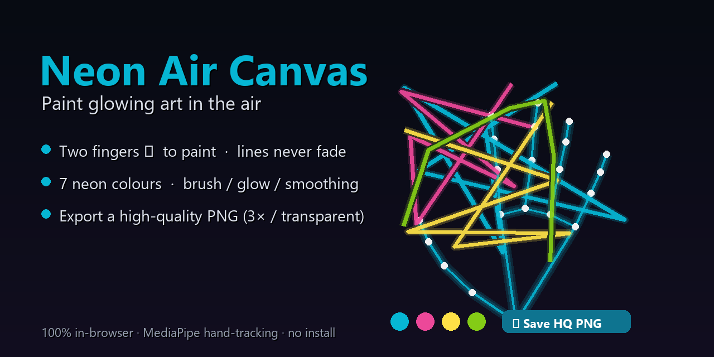

# Neon Air Canvas 🎨 — paint in the air with your hand



Air-paint glowing neon artwork with your fingertip — **lines never fade** until you clear them, and
you can **export a high-quality PNG** (vectors re-rendered at 3× / ≥2048px, optional transparent
background). 100% in-browser, GPU hand-tracking via MediaPipe.

## Use
```powershell
./serve.ps1        # open http://localhost:8500 in Chrome or Edge
```
Raise one hand, hold up **two fingers (index + middle ✌️)** to paint. Open your hand to move without
drawing. No camera? **Drag with the mouse.**

## Features
- Persistent neon strokes (never fade), 7 colors, brush size / glow / smoothing sliders.
- **Undo** and **Clear**.
- **Save HQ PNG** — strokes are stored as vectors and re-rendered at 3× (≥2048px) for crisp export;
  optional **transparent background**.
- Two-finger draw with a low-FPS-safe grace window; always-on fingertip cursor.

## Tech
Vanilla JS + Tailwind (CDN) · MediaPipe Tasks-Vision HandLandmarker (GPU/WASM) · Canvas 2D.

MIT licensed.
